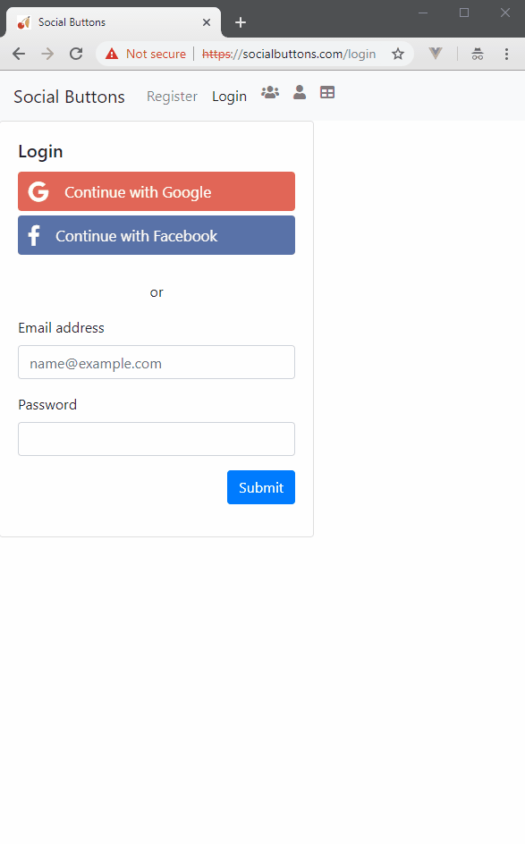

# Real life implementation of Social Login using Google/Facebook (Python3)

- Uses hybrid/implicit flow for Google (get the `id_token`) and verify it
- Users hybrid/server flow for Facebook (get the `access_code` and access
user's basic profile information via graph API)

## Google: get the `id_token` and verify it's signature (or verify via a request)
## Facebook: the the `access_code` and further on get user's public profile

## Installation instructions

Steps highly compressed in descripton, it will take you some time to match and configure
the Facebook App and Google Project.

- Configure in your `/etc/hosts` the domain `socialbuttons.com` to point to `127.0.0.1`
- create the `credentials.json` file (see bellow)
- prepare the database (`db.sql`)
- create a virtualenv (`python -m venv venv`) and source it
- install for development `python3 -m pip install -e .`
- execute `serve`

- Create a Google Project and get your `google-client-id`, `google-client-secret`
(use the `socialbuttons.com` domain)
- Create a Facebook app and get your `facebook-client-id`, `facebook-client-secret`
(use the `socialbuttons.com` domain)

## `credentials.json`

Configure accordingly

```json
{
    "google-client-id": "3150046XXXX5-k9m58flrf24XXXXXp5p6pfmfpmvvt.apps.googleusercontent.com",
    "google-secret": "efPmCHXXXXMHromXXXoO_ZXX",

    "facebook-client-id": "300005464000852",
    "facebook-secret": "1955000000b2aa48c000000eb6",

    "mysql-username": "root",
    "mysql-password": "password"
}

```

# Register non existing user


Trying to login with facebook, will result in **pre-filling** the registration form.
Upon completion the user is registered.



# Register existing user

Trying to register with an email that already exists in the database the user accounts are merged

